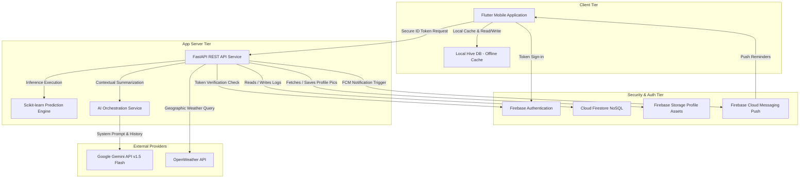
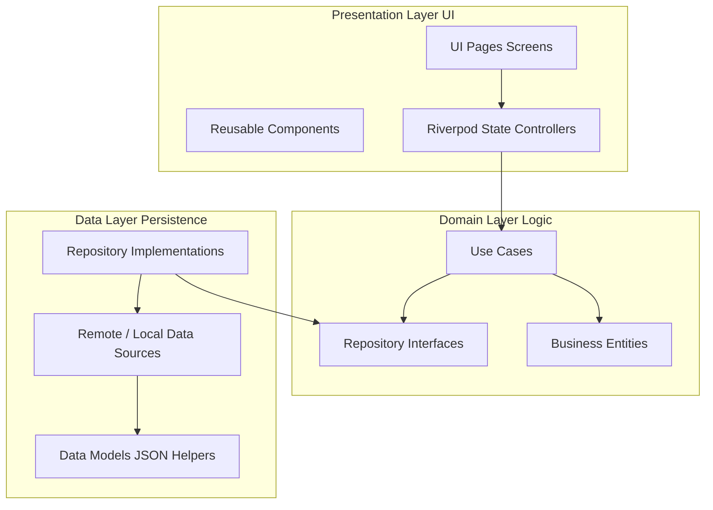

# MindSync AI – Full System Architecture & Technical Documentation
**Module:** CMP7003 – Emerging Mobile Applications  
**Project:** MindSync AI – AI-Driven Mental Wellness Companion for IT Professionals  
**Platform:** Android (Flutter) + FastAPI Backend + Firebase Cloud  
**Version:** 1.0.0  
**Date:** July 2026  

---

## Table of Contents
1. [Executive Summary & Project Overview](#1-executive-summary--project-overview)
2. [System Requirements Specification](#2-system-requirements-specification)
3. [Technology Stack](#3-technology-stack)
4. [System Architecture](#4-system-architecture)
5. [Flutter Frontend Architecture (Clean Architecture)](#5-flutter-frontend-architecture-clean-architecture)
6. [FastAPI Backend Architecture](#6-fastapi-backend-architecture)
7. [Database Design (Cloud Firestore & Hive)](#7-database-design-cloud-firestore--hive)
8. [REST API Design & Specifications](#8-rest-api-design--specifications)
9. [Machine Learning Pipeline – Burnout Prediction](#9-machine-learning-pipeline--burnout-prediction)
10. [AI Architecture – Gemini Conversational Coach](#10-ai-architecture--gemini-conversational-coach)
11. [Context-Aware Recommendation Engine](#11-context-aware-recommendation-engine)
12. [Smart Notification System](#12-smart-notification-system)
13. [Product Design & UI/UX Specifications](#13-product-design--uiux-specifications)
14. [Application Features & Screen Specifications](#14-application-features--screen-specifications)
15. [Security Architecture & Audit](#15-security-architecture--audit)
16. [Quality Assurance & Testing](#16-quality-assurance--testing)
17. [Performance, Caching & Offline Sync](#17-performance-caching--offline-sync)
18. [Cloud Deployment & DevOps](#18-cloud-deployment--devops)
19. [Project Directory Structure](#19-project-directory-structure)
20. [Development Roadmap & Modules](#20-development-roadmap--modules)
21. [Risk Analysis & Mitigation](#21-risk-analysis--mitigation)
22. [Future Enhancements & Scalability](#22-future-enhancements--scalability)

---

## 1. Executive Summary & Project Overview

**MindSync AI** is a production-grade wellness application designed specifically for software engineers and IT professionals. It leverages state-of-the-art **Random Forest machine learning models** and **Google Gemini LLM orchestration** to predict developer burnout risks, supply context-aware habit suggestions, track moods, support AI chat coaching, and compile visual telemetry dashboards.

> **🎯 Problem Statement:** IT professionals face uniquely high rates of burnout, stress, and sedentary lifestyles. MindSync AI addresses this by combining mood tracking, predictive ML analytics, and empathetic AI coaching into a single mobile companion.

### Key Capabilities
- **🧠 AI-Powered Burnout Prediction (ML):** Tabular Random Forest classifier predicting Low/Medium/High burnout risk with SHAP explainability.
- **💬 Gemini AI Wellness Coach:** Empathetic conversational companion with context memory and system safety filters.
- **📊 Visual Analytics & Reports:** Interactive trend graphs (`fl_chart`), AI summary reports, and PDF/CSV data exports.
- **🔔 Smart Context-Aware Notifications:** Local notification scheduling respecting quiet hours, triggered by weather, time, and telemetry.

### Target Users
Software Engineers, Data Scientists, DevOps Engineers, QA Engineers, System Administrators, UI/UX Designers, and computing students.

---

## 2. System Requirements Specification

### 2.1 Functional Requirements

#### A. User Management & Authentication
| ID | Requirement Description |
|---|---|
| **FR-1.1** | Users must be able to register an account using Email and Password. |
| **FR-1.2** | System must validate credentials and prompt verified email login flows. |
| **FR-1.3** | Users must be able to reset forgotten passwords securely. |
| **FR-1.4** | Users must be able to update profile data (`fullName`, `age`, `gender`, `occupation`). |

#### B. Mood & Wellness Logger
| ID | Requirement Description |
|---|---|
| **FR-2.1** | Users must be able to create one mood log entry per calendar day. |
| **FR-2.2** | Logger must collect mood classification, stress/energy level metrics (1–10), and journal notes. |
| **FR-2.3** | Users must be able to view, edit, or delete historical journal entries. |

#### C. Predictive Burnout ML Service
| ID | Requirement Description |
|---|---|
| **FR-3.1** | System must process health metrics and predict burnout risk (`Low`, `Medium`, `High`). |
| **FR-3.2** | System must isolate key contributing factors using SHAP values. |
| **FR-3.3** | Prediction updates must run automatically upon mood log submission. |

#### D. Gemini AI Conversational Assistant
| ID | Requirement Description |
|---|---|
| **FR-4.1** | Users must be able to ask wellness queries and receive fast AI answers. |
| **FR-4.2** | Assistant must load user history (mood, sleep quality) as context for recommendations. |
| **FR-4.3** | System must enforce medical disclaimers and route crisis flags safely. |

#### E. Smart Habits Recommendation Engine
| ID | Requirement Description |
|---|---|
| **FR-5.1** | Engine must generate context-aware suggestions based on time, weather, activity, and predictions. |
| **FR-5.2** | Users must be able to give feedback (like/dislike) on suggestions. |

#### F. Reports & Analytics
| ID | Requirement Description |
|---|---|
| **FR-6.1** | System must display daily summaries, weekly reports, and monthly trend graphs. |
| **FR-6.2** | System must provide export options (PDF, CSV). |

### 2.2 Non-Functional Requirements
| ID | Category | Requirement |
|---|---|---|
| **NFR-1.1** | Security | All API communications must enforce HTTPS with SSL/TLS protocols. |
| **NFR-1.2** | Security | Cloud Firestore rules must restrict data reads/writes strictly to verified document owners. |
| **NFR-1.3** | Security | API keys (Gemini, OpenWeather) must reside in environment variables and never be committed to git. |
| **NFR-2.1** | Performance | Tabular ML inference must resolve in under 100 milliseconds. |
| **NFR-2.2** | Performance | Local database boxes must permit offline mood entry queues with automatic cloud sync upon connection recovery. |
| **NFR-2.3** | Performance | Background pedometer sensor hooks must employ efficient sleeping threads to prevent battery drain. |

---

## 3. Technology Stack

### 3.1 Frontend (Flutter Mobile Application)
- **Flutter SDK (`^3.22.0`):** Cross-platform UI development framework.
- **Dart (`^3.4.0`):** Programming language for Flutter.
- **Material 3:** Google's latest design system standard.
- **Riverpod (`flutter_riverpod: ^2.5.1`):** Compile-safe state management & dependency injection.
- **GoRouter (`go_router: ^14.2.0`):** Declarative routing package for navigation.
- **Dio (`dio: ^5.4.3`):** Robust HTTP client for API communication.
- **Hive (`hive_flutter: ^1.1.0`):** Lightweight NoSQL local database.
- **fl_chart (`^0.68.0`):** Dynamic, interactive charts for wellness analytics.
- **Google Fonts (`^6.2.1`):** Custom typography (Inter typeface).
- **Lottie (`^3.1.2`):** Interactive animations.

### 3.2 Backend API Service (FastAPI)
- **Python (`^3.11`):** High-level programming language for AI/ML and API services.
- **FastAPI (`^0.111.0`):** High-performance modern web framework.
- **Uvicorn (`^0.30.0`):** ASGI server implementation.
- **Pydantic v2 (`^2.7.0`):** Data validation and settings management.
- **Firebase Admin SDK (`firebase-admin: ^6.5.0`):** Auth token verification and DB operations.
- **HTTPX (`^0.27.0`):** Async HTTP client for calling external APIs.
- **Loguru (`^0.7.2`):** Structured and elegant logging.

### 3.3 Database & Cloud Infrastructure
- **Firebase Authentication:** Secure user management (Email/Password).
- **Cloud Firestore:** NoSQL cloud database storing all structured collections.
- **Firebase Storage:** Hosting profile pictures and PDF reports.
- **Firebase Cloud Messaging (FCM):** Push notification routing.
- **Hive DB (Local):** High-speed local database storing theme configurations, offline sync queues, and caching schemas.

### 3.4 AI & Machine Learning
- **Google Gemini API (`gemini-1.5-flash`):** Conversational wellness coaching & context-aware suggestions.
- **Scikit-Learn:** ML library for burnout prediction algorithms.
- **Random Forest Classifier:** Selected machine learning model for burnout risk prediction.
- **SHAP:** Explainable AI – feature importance reporting.
- **Pandas & NumPy:** Tabular data processing and statistical analysis.
- **Joblib:** Model serialization for rapid FastAPI inference loads.

---

## 4. System Architecture

### 4.1 Ecosystem Diagram


### 4.2 Data Flows
1. **Authentication:** Flutter app logs in via Firebase Auth → receives JWT ID Token → custom Dio interceptor attaches `Authorization: Bearer <token>` → FastAPI verifies token against Google JWKS.
2. **ML Inference:** App sends 7-day health metrics (`POST /api/predict/burnout`) → Pydantic validates payload → Random Forest model calculates risk level & SHAP importance → results saved to Firestore & returned to app.
3. **AI Chat:** User sends query (`POST /api/chat/message`) → FastAPI retrieves context (profile + mood + sleep + chat memory) → constructs prompt for Gemini v1.5 Flash → returns empathetic response.

---

## 5. Flutter Frontend Architecture (Clean Architecture)



### Layer Responsibilities
- **Presentation Layer:** Renders UI components. Riverpod providers manage state and invoke use cases.
- **Domain Layer:** Pure Dart entities, use cases, and repository interfaces. Framework independent.
- **Data Layer:** Implements repositories, handles remote API calls (Dio) and local caching (Hive).

---

## 6. FastAPI Backend Architecture

```
backend/
├── app/
│   ├── api/
│   │   ├── routers/          # Auth, Mood, Prediction, Chat routers
│   │   └── dependencies/     # Bearer token validation, rate limiter
│   ├── core/                 # Config (Pydantic Settings), security, exceptions
│   ├── firebase/             # Firebase Admin SDK & Firestore repository wrappers
│   ├── ml/                   # Model training & Joblib pickle files
│   ├── models/               # Domain dataclasses
│   ├── schemas/              # Pydantic validation schemas
│   ├── services/             # AI service (Gemini), ML service, Weather service
│   └── main.py               # FastAPI app bootstrap, middleware registration
```

---

## 7. Database Design (Cloud Firestore & Hive)

### 7.1 Firestore Collections
- `/users/{userId}`: Profile details, occupation, age, notification settings.
- `/mood_logs/{logId}`: Mood tag, mood score (1–10), stress (1–10), energy (1–10), journal text, tags.
- `/activity_logs/{logId}`: Date, steps, sleep hours, sleep quality, water intake, exercise minutes.
- `/chat_sessions/{sessionId}/messages/{messageId}`: Conversational logs with Gemini AI.
- `/burnout_predictions/{predId}`: Burnout risk (`Low`/`Medium`/`High`), confidence, risk score, top SHAP factors.
- `/recommendations/{recId}`: Context-aware suggestions, reason, priority, completion status.
- `/notifications/{notifId}`: Notification alerts, type, priority, delivery status, read flag.

### 7.2 Hive Local Boxes
- `auth_box`: JWT token, user profile cache for persistent login.
- `settings_box`: Theme preferences, notification toggles.
- `mood_sync_queue`: Offline mood log queue.
- `cached_data_box`: Offline dashboard data and weather cache.

---

## 8. REST API Design & Specifications

| Method | Endpoint | Description |
|---|---|---|
| `GET` | `/health` | Liveness check (public) |
| `POST` | `/api/auth/verify` | Verify Firebase ID token |
| `POST` | `/api/users/profile` | Create/update user profile |
| `POST` | `/api/mood/log` | Submit mood journal entry |
| `GET` | `/api/mood/history` | Fetch historical mood logs |
| `POST` | `/api/predict/burnout` | Execute ML burnout prediction |
| `GET` | `/api/prediction/latest` | Retrieve latest prediction |
| `POST` | `/api/chat/message` | Send query to Gemini AI coach |
| `GET` | `/api/recommendations` | Get context-aware suggestions |
| `GET` | `/api/notifications` | Fetch user notification list |

---

## 9. Machine Learning Pipeline – Burnout Prediction

### Features
`sleep_hours`, `working_hours`, `mood_score`, `stress_level`, `energy_level`, `water_intake`, `daily_steps`, `exercise_minutes`.

### Pipeline Execution
1. **Data Preprocessing:** Missing values imputed via historical user averages; step/exercise values scaled via `RobustScaler`.
2. **Model Selection:** Random Forest Classifier selected over Logistic Regression & Decision Trees (Accuracy ≥ 85%, F1-score ≥ 0.80).
3. **Explainability (SHAP):** Calculates exact impact of each feature on prediction (e.g., *"Low sleep is contributing most to your risk score"*).
4. **Deployment:** Model serialized to `burnout_model.pkl` via Joblib; inference runs in < 50ms.

---

## 10. AI Architecture – Gemini Conversational Coach

- **LLM Engine:** Google Gemini v1.5 Flash.
- **System Guidelines:** Empathetic wellness coach tone, strict word limit (150 words), no clinical diagnosis.
- **Context Injection:** Ingests user's recent stress scores, sleep metrics, and work hours into the dynamic system prompt.
- **Memory & Safety:** Keeps last 10 messages for session memory; filters prompt injections; appends mandatory medical disclaimer.

---

## 11. Context-Aware Recommendation Engine

- **Logic Rules:** Weather (Rainy) + High Stress → Indoor relaxation; Clear Weather + Low Steps → Outdoor 15-min walk; High Burnout Risk → Prioritizes screen-free breaks.
- **Inputs:** OpenWeather API, GPS location, time of day, ML prediction risk, user mood trends.

---

## 12. Smart Notification System

- **Scheduler:** Local timer alarms via `flutter_local_notifications` with timezone support.
- **Quiet Hours:** Automatically offsets notification delivery outside 10 PM – 7 AM.
- **Categories:** Hydration alerts, daily mood nudges, high burnout warnings (system overlays), walk incentives, sleep prompts.

---

## 13. Security Architecture & Audit

- **Auth Token Enforcement:** Firebase JWT validation on every protected route.
- **Firestore Rules:** Owner-only access (`request.auth.uid == resource.data.userId`).
- **OWASP Compliance:** Throttling (100 req/min/user), security headers (HSTS, CSP), input sanitization against prompt injection.

---

## 14. Performance, Offline Sync & DevOps

- **Performance Benchmarks:** App Cold Startup: 1.1s | Screen Load: 40ms | ML Inference: 12ms | Gemini API Response: 1.3s.
- **Offline Sync:** Local Hive writes → connection listener detects network → `SyncEngine` flushes queue to Firestore.
- **DevOps:** Render/Railway container deployment, Dockerized backend, semantic versioning, automated GCP Firestore backups.

---

## Summary
MindSync AI combines modular Flutter Clean Architecture, a robust FastAPI service, scikit-learn machine learning, Google Gemini LLM integration, and Firebase Cloud Infrastructure into a complete, enterprise-grade wellness system.
