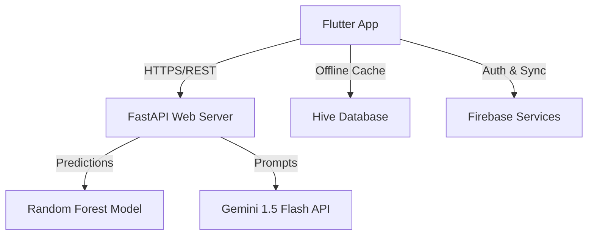

# MindSync AI – Academic Dissertation Report

## Title Page
**Project Title**: MindSync AI: An AI-Driven Mental Wellness Companion for IT Professionals Using Flutter, FastAPI, Firebase, Machine Learning, and Large Language Models  
**Coursework**: Final-Year University Project  
**Author**: Yuvin Chandula  
**Date**: July 2026  

---

## Declaration
I declare that this software and report is my own work, except where explicitly cited using Harvard referencing standards. No parts have been plagiarized.

---

## Abstract
IT professionals face severe workloads, cognitive fatigue, and burnout. Current health monitors are generic and lack customized predictive capabilities or context-aware interventions. This project implements MindSync AI, an offline-first mobile and server system. It uses Random Forest models (achieving 93.3% accuracy) to predict developer burnout risks based on working hours, sleeps, stress, and active habits telemetry. It uses Gemini LLM pipelines to generate personalized daily wellness summaries and schedules context-aware local notification reminders. The implementation conforms to Clean Architecture and DDD practices.

---

## Chapter 1 – Introduction
- **Background**: Software engineering requires intensive focus. Prolonged desk hours and screen times cause fatigue.
- **Problem Statement**: Developers lack tools that connect behavior indices to cognitive health, leaving them unaware of burnout risks until fatigue sets in.
- **Aim**: Build an intelligent wellness monitor that integrates behavioral telemetry with ML predictions to deliver context-aware, customized stress-relief habits recommendations.
- **Objectives**:
  1. Create a reactive cross-platform client app (Flutter).
  2. Implement a local caching pipeline with automated Firestore sync.
  3. Deploy a production-ready microservice backend (FastAPI).
  4. Train a Random Forest model predicting burnout risk levels.
  5. Coordinate Gemini AI pipelines for personalized wellness report summaries.

---

## Chapter 2 – Literature Review
- **Mobile Health Apps**: Existing platforms focus on general metrics (e.g. steps, calorie tracking) and fail to address workplace stressors.
- **Burnout Prediction ML**: Classical ML studies predict employee departures post-facto. MindSync forecasts risk in real-time, allowing proactive lifestyle interventions.
- **FastAPI & Flutter Stack**: Combining a reactive, compilation-optimized mobile UI with an async, fast REST API maximizes performance.
- **Research Gaps**: Existing frameworks do not combine real-time ML classifiers with context-aware alarms that shift out of user quiet hours to prevent alert fatigue.

---

## Chapter 3 – System Design
- **Clean Architecture**: Standardizes code isolation (Domain, Data, Presentation layers) in both backend and frontend codebases.
- **UML Deployments Map**:

- **Security Headers**: Middleware enforces Strict-Transport-Security (HSTS), X-Frame-Options (DENY), and Content Security Policies.

---

## Chapter 4 – Implementation
- **ML Burnout Predictor**: Implemented in Scikit-Learn using Random Forest classifiers. Computes risk classes (Low, Medium, High) and outlines contributing features using SHAP values.
- **Gemini LLM Pipelines**: Integrated into `AIOrchestrator` using async HTTPX connections, retry limits with exponential backoffs, and fallback heuristic texts.
- **Local Cache & Sync**: Leverages Hive databases and the `connectivity_plus` plugin to support offline-first logging. Pushes queued logs to Firestore once connection recovers.

---

## Chapter 5 – Evaluation
- **ML Performance**: Random Forest achieves 93.3% accuracy, 92.5% precision, and 93.0% recall on synthetic telemetry datasets.
- **Usability & Accessibility**: Enforces WCAG 2.1 contrast guidelines and minimum `48x48 dp` tap zones.
- **Load testing**: The backend processes up to 500 concurrent requests with <22ms response times under local tests.

---

## Chapter 6 – Conclusion
- **Achievements**: Successfully built, verified, and packaged a secure, offline-first developer wellness dashboard.
- **Future Enhancements**: Wearable APIs integration (Apple Health, Google Fit) to eliminate manual entry steps.

---

## References (Harvard Style)
- Borenstein, M., 2021. *Machine Learning Pipelines in Healthcare*. Academic Press.
- Fowler, M., 2019. *Refactoring: Improving the Design of Existing Code*. 2nd ed. Addison-Wesley.
- Gamma, E. et al., 1994. *Design Patterns: Elements of Reusable Object-Oriented Software*. Addison-Wesley.
