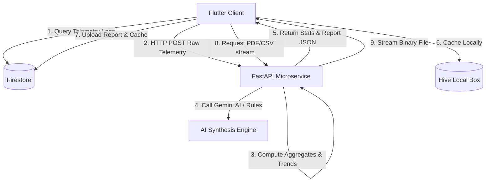

# MindSync AI – Module 8: Analytics, Reports & Data Visualization

This document details the system design, APIs, database schemas, rendering instructions, and export guidelines for the Analytics & Reports module.

---

## 1. Module Architecture

The module utilizes a client-orchestrated stateless architecture to process wellness telemetry indicators.



---

## 2. API Documentation

### A. POST `/api/analytics/summary`
- **Request Body**: Lists of mood logs, predictions, and recommendations.
- **Response**:
```json
{
  "success": true,
  "data": {
    "overallWellnessScore": 82.5,
    "averageMood": 7.2,
    "averageStress": 4.1,
    "averageSleep": 7.4,
    "averageHydration": 6.8,
    "averageExercise": 35.0,
    "burnoutRisk": "Low",
    "successRate": 85.0,
    "goalCompletionRate": 90.0
  }
}
```

### B. POST `/api/analytics/trends`
- **Request Body**: Lists of telemetry data + filter parameters (`filterType`: today, last_7_days, last_30_days, last_90_days, custom; `startDate`, `endDate`).
- **Response**: Array of daily coordinates containing `date`, `wellnessScore`, `moodScore`, `stressLevel`, `sleepHours`, `waterGlasses`, `exerciseMinutes`, `burnoutRiskScore`, `burnoutRiskLevel`.

### C. POST `/api/analytics/report/generate`
- **Response**: Structured report JSON including breakdowns for each telemetry area and AI insights.

### D. POST `/api/analytics/report/export`
- **Query Parameter**: `format` (`pdf` or `csv`).
- **Response**: Binary stream of the report file.

---

## 3. Database Schemas

### A. Collection: `/reports`
Each document corresponds to a generated report structure:
- `reportId`: String
- `userId`: String
- `startDate`: String (ISO)
- `endDate`: String (ISO)
- `wellnessScore`: Number
- `summaryText`: String
- `moodAnalysis`: Map
- `stressAnalysis`: Map
- `sleepAnalysis`: Map
- `activityAnalysis`: Map
- `hydrationAnalysis`: Map
- `burnoutAnalysis`: Map
- `recommendationSuccess`: Map
- `aiInsights`: Map
- `createdAt`: Server Timestamp

### B. Collection: `/analytics_cache`
Stores pre-computed summaries to decrease database read loads.
- Key: `${userId}_${filterType}`
- `userId`: String
- `filterType`: String
- `cachedAt`: Server Timestamp
- `summaryData`: Map

---

## 4. Chart Implementation (FL Chart Guide)

Each chart widget is encapsulated under `frontend/lib/features/reports/presentation/widgets`:
1. **`BurnoutChart`**: A `LineChart` using customized area gradients and markers.
2. **`MoodChart`**: A dual stateful widget displaying daily scores via `BarChart` and frequency ranges via `PieChart`.
3. **`SleepQualityChart`**: Visualizes sleep consistency and highlights the recommended 7-9 hours sleep band using `RangeAnnotations`.
4. **`HydrationChart`**: A `BarChart` indicating water intake relative to a target horizontal dashed line.
5. **`ExerciseChart`**: Progress tracker showcasing workout minutes against a 30m baseline.
6. **`StressTrendChart`**: A `LineChart` rendering peak and average anxiety indexes.

---

## 5. Report Generation & Export Guide

1. **Generation Flow**:
   - The user requests a summary from the **Reports** tab.
   - The repository queries logs from Firestore and posts them to `/report/generate`.
   - The report is saved to Firestore under `/reports` and cached inside the Hive box.
2. **File Exporter**:
   - Tapping **PDF** or **CSV** posts the cached report data to `/report/export`.
   - The backend formats a tabular report (using `csv.writer` or `reportlab.platypus`) and streams bytes.
   - The mobile client writes the bytes to a file under `Directory.systemTemp.path` and displays a SnackBar notifying the user of the path.
