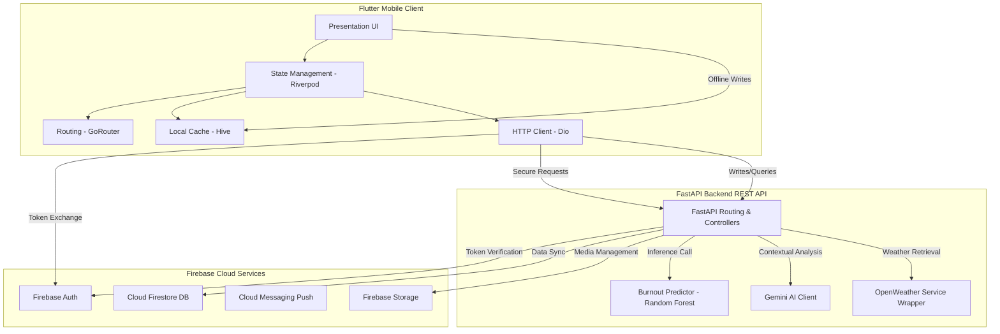

# MindSync AI – System Architecture & Clean Design

This document details the high-level system architecture, component integrations, Flutter Clean Architecture layers, FastAPI backend organization, and key communication flows.

---

## 1. High-Level System Architecture

MindSync AI is composed of a cross-platform Flutter mobile client, a Python FastAPI backend hosting machine learning and third-party API integration, and Firebase cloud services for real-time authentication and database requirements.



---

## 2. Flutter Architecture (Presentation, Domain, Data)

To support decoupling, modularity, and testability, the Flutter mobile client implements **Clean Architecture** organized around features.

```
lib/
├── core/                         # Cross-cutting concerns (Global)
│   ├── constants/                # App strings, color tokens, assets
│   ├── theme/                    # Material 3 light/dark styles
│   ├── routing/                  # GoRouter configuration
│   ├── services/                 # Local preferences, Hive initialization
│   ├── network/                  # Dio clients and global interceptors
│   ├── errors/                   # Exception classes & Failure mapping
│   └── utils/                    # Validations, formatters
│
├── features/                     # Feature modules (Domain-driven)
│   ├── authentication/
│   ├── dashboard/
│   ├── mood/
│   ├── chat/
│   ├── reports/
│   ├── recommendations/
│   ├── notifications/
│   ├── profile/
│   └── settings/
│       ├── domain/               # Domain Layer (Pure Dart, Framework Independent)
│       │   ├── entities/         # Business objects/data classes
│       │   ├── usecases/         # Application-specific business rules
│       │   └── repositories/     # Abstract interfaces defining contracts
│       │
│       ├── data/                 # Data Layer (Framework Specific)
│       │   ├── datasources/      # Remote (REST/Firebase) and Local (Hive) sources
│       │   ├── models/           # Data serialization classes (JSON helpers)
│       │   └── repositories/     # Concrete implementations of domain contracts
│       │
│       └── presentation/         # Presentation Layer (UI & Widgets)
│           ├── pages/            # Scaffold screens
│           ├── providers/        # Riverpod StateNotifiers / StateProviders
│           └── widgets/          # Reusable component elements
│
└── shared/                       # Reusable elements shared across features
    ├── widgets/                  # Generic UI components (AppButtons, loaders)
    ├── models/                   # Common entities
    └── providers/                # Shared state trackers (App Theme, Network Status)
```

### Clean Architecture Layer Responsibilities:
1.  **Domain Layer**: Contains pure business logic. It does not depend on database adapters, Flutter widgets, or network libraries. It defines the core data structure (`Entities`), abstract `Repositories` definitions, and individual logical commands (`UseCases`).
2.  **Data Layer**: Responsible for retrieval and mutation of data. It maps JSON or Firestore documents to programmatic data schemas (`Models`) and handles local caching strategies, communicating via custom `DataSources`.
3.  **Presentation Layer**: Responsible for rendering view states and reacting to user gestures. It leverages Riverpod for state management, mapping visual layouts (`Pages`) to business events using reactive state containers (`Providers`).

---

## 3. Python Backend Architecture (FastAPI)

The backend code uses a layered structure separation to segregate routing protocols, domain logic modules, and database operations.

```
backend/
├── app/
│   ├── api/
│   │   ├── routers/              # API Route endpoints & path parameter handlers
│   │   └── dependencies/         # FastAPI Dependency Injection (Security headers, Auth check)
│   │
│   ├── services/                 # Central Business Logic orchestrator
│   │   ├── ai_service.py         # Gemini API generation client wrapper
│   │   ├── ml_service.py         # Tabular burnout inference loader
│   │   └── weather_service.py    # OpenWeather API data client
│   │
│   ├── firebase/                 # Firebase integration configs
│   │   ├── admin_sdk.py          # Firebase initialization & context wrappers
│   │   └── firestore_repo.py     # General database CRUD integrations
│   │
│   ├── models/                   # ORM/ODM structural entities
│   ├── schemas/                  # Pydantic schemas (Data serialization & constraints)
│   │
│   ├── core/                     # Globals & Config files
│   │   ├── config.py             # Environment configurations
│   │   ├── security.py           # API token parsing
│   │   └── exception_handler.py  # Global router error adapters
│   │
│   └── main.py                   # App initializer & middleware register
│
├── ml/                           # Data Science scripts
│   ├── train.py                  # Model training and optimization
│   ├── evaluate.py               # Comparative metrics execution
│   └── models/                   # Pre-compiled Joblib model assets
│
├── requirements.txt              # Production dependency list
└── .env                          # App keys & Secret strings (Local only)
```

---

## 4. Key Request & Data Flows

### A. Authentication & Route Protection Flow
1.  The mobile client enters credentials on the **Login Screen**.
2.  The client issues a login request directly to **Firebase Authentication**.
3.  Upon verification, Firebase Auth returns a **JSON Web Token (ID Token)** to the app.
4.  The mobile client caches the ID Token and attaches it as an `Authorization: Bearer <token>` header to all subsequent API requests sent via **Dio** to the FastAPI backend.
5.  FastAPI's security dependency intercepts the request, calls the Firebase Admin SDK to decode and verify the token signature, and extracts the verified User ID (`uid`).
6.  If valid, the endpoint processes the query. If expired/invalid, it returns `401 Unauthorized`.

### B. Machine Learning Burnout Prediction Flow
1.  The user requests a burnout prediction update from the mobile client.
2.  The mobile client aggregates user parameters (Sleep, working hours, stress level, steps, water) from the local **Hive DB** and sends a `POST` request to FastAPI at `/api/predict/burnout`.
3.  FastAPI schema validation ensures compliance with data boundaries.
4.  The request passes parameters to the `MLService`, which normalizes features and feeds them into the loaded **Random Forest model**.
5.  The model outputs the prediction score and risk category (`Low`, `Medium`, or `High`).
6.  The result is persisted in the Firestore DB `BurnoutPredictions` collection under the caller's `uid`, and the prediction payload is returned to the mobile app for rendering.
