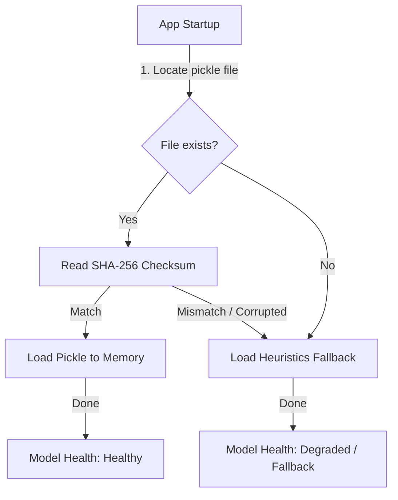

# MindSync AI – Module 12: MLOps, AI Orchestration & Background Processing

This document explains the production systems for ML model lifecycles, Gemini AI pipelines, background task processing, and diagnostic checks.

---

## 1. MLOps & Model Manager Architecture

The model manager validates features, checks files, and monitors accuracy.

---

## 2. AI Orchestration & Response Pipelines

- **Exponential Backoff**: AIOrchestrator requests Gemini endpoints via HTTPX async client. If failures occur (timeouts, 503 Service Unavailable, rate limiting), it retries up to 3 times with exponential backoff (`1s`, `2s`, `4s`).
- **Graceful Fallbacks**: If all retry attempts fail, the orchestrator retrieves a predefined default response to ensure the mobile app experience remains smooth.
- **Cache-Aside Pattern**: Answers are cached in the `CacheService` in-memory store. Subsequent identical queries resolve in milliseconds without contacting Google servers.

---

## 3. central Prompt templates Library

Templates are centralized in `app.core.prompt_library.PromptLibrary` to isolate prompts from business logic:
- `daily_summary`: Translates telemetry scores into concise health tips.
- `weekly_report`: Renders markdown reports summarizing work stress metrics.
- `chat_coaching`: Configures chatbot personality to mimic an IT wellness coach.
- `motivational_quote`: Returns short inspirational coding/wellness analogies.

---

## 4. Background Scheduler

The backend features a zero-dependency async scheduling worker:
- **Nightly Loop**: Wipes local temp directories and flushes older expired entries from the cache every 24 hours.
- **Recommendations Refresh Loop**: Pre-compiles personalized recommendation metrics in Firestore twice daily.

---

## 5. Health Check Diagnostics API

The `/api/health/details` API checks system components:
- **api**: checks web server status.
- **database**: verifies Firestore client connectivity.
- **ai_service**: checks if Google Gemini credentials are loaded.
- **ml_model**: returns model initialization, version, type, and checksum.
- **background_worker**: checks scheduler state.
