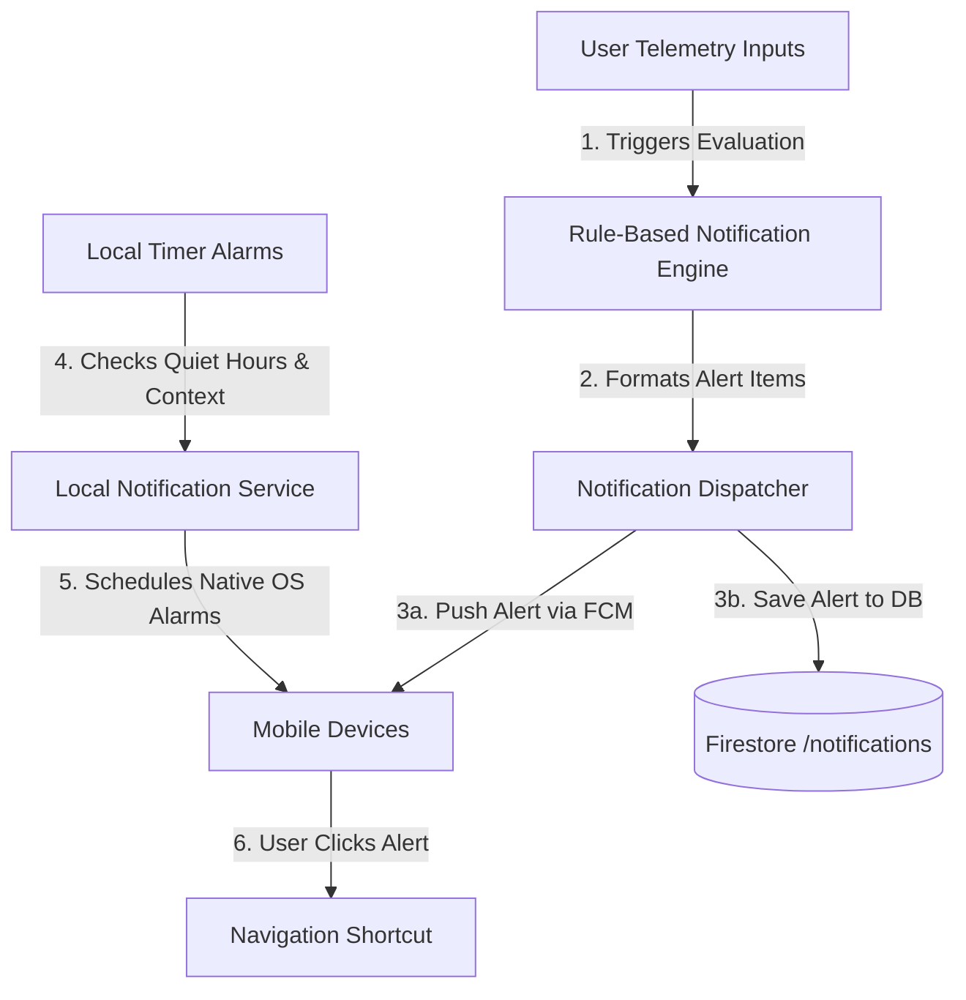

# MindSync AI – Module 9: Smart Notifications, Background Services & Context Awareness

This document details the software design, local scheduler, background tasks, FCM configuration, and schemas for the Notifications & Context system.

---

## 1. Notification Architecture

The system utilizes a split engine design (Backend Rules Engine + Frontend Local Scheduler) to provide timely context-aware alerts.



---

## 2. API Documentation

### A. GET `/api/notifications`
- **Response**: List of notification items.
```json
{
  "success": true,
  "data": [
    {
      "notificationId": "notif_123",
      "userId": "usr_mock_123",
      "title": "Welcome to MindSync",
      "message": "Let's check in on your habits today.",
      "type": "wellness",
      "priority": "low",
      "scheduledTime": "2026-07-23T08:00:00Z",
      "sentTime": "2026-07-23T08:00:00Z",
      "status": "sent",
      "isRead": false,
      "source": "backend_engine",
      "createdAt": "2026-07-23T08:00:00Z"
    }
  ]
}
```

### B. POST `/api/notifications/{notificationId}/read`
- **Response**: Status confirmation.

### C. DELETE `/api/notifications/{notificationId}`
- **Response**: Status confirmation.

### D. POST `/api/notifications/preferences`
- **Request Body**: Preferences schema dict.
- **Response**: Updated preferences.

### E. GET `/api/notifications/preferences`
- **Response**: Current preferences dict.

### F. POST `/api/notifications/sync`
- **Request Body**: Array of offline logged notifications.
- **Response**: Sync statistics.

### G. POST `/api/notifications/trigger-evaluation`
- **Request Body**: Telemetry indicators:
```json
{
  "sleepHours": 5.5,
  "workingHours": 10.0,
  "moodScore": 3,
  "stressLevel": 8,
  "energyLevel": 4,
  "waterIntake": 4,
  "dailySteps": 4500,
  "exerciseMinutes": 15,
  "burnoutRisk": "High"
}
```
- **Response**: List of rule-triggered notifications generated.

---

## 3. Local Notification Scheduler & Timezones

### Scheduling Logic
- Handled via `NotificationService` wrapper around `flutter_local_notifications`.
- Initializes timezone bindings using `timezone/data/latest_all.dart`.
- **Quiet Hours Offset**: When scheduling, the scheduler checks if the targeted hour falls inside the user's quiet hours (e.g. 10 PM - 7 AM). If so, it adjusts the alarm to trigger at the end of the quiet hours (7 AM).
- **Timezone Support**: All times are converted to `tz.TZDateTime` using `tz.local` to trigger correctly at local device times.

---

## 4. Background Sync & Offline Support

### Action Queue
When the mobile device is offline, modifications to notifications (marking read, deleting, updating preferences) are stored in the Hive box (`AppConstants.moodSyncBoxName`) under `notification_offline_queue`.
Upon connection renewal (detected via `Connectivity` listener in the context engine), the repository uploads queued operations to the FastAPI endpoints in order.

---

## 5. Firestore Schemas

### A. Collection: `/notifications`
- `userId`: String
- `title`: String
- `message`: String
- `type`: String ('wellness', 'water', 'sleep', 'break', 'burnout', 'goal', 'streak', 'mood', 'quote')
- `priority`: String ('low', 'medium', 'high', 'critical')
- `scheduledTime`: Timestamp
- `sentTime`: Timestamp
- `status`: String
- `isRead`: Boolean
- `source`: String
- `createdAt`: Timestamp

### B. Collection: `/notification_preferences`
- `pushEnabled`: Boolean
- `dailyReminders`: Boolean
- `weeklySummaries`: Boolean
- `aiSuggestions`: Boolean
- `motivationMessages`: Boolean
- `goalReminders`: Boolean
- `soundEnabled`: Boolean
- `vibrationEnabled`: Boolean
- `wakeUpTime`: String ('HH:MM')
- `sleepTime`: String ('HH:MM')
- `waterFrequencyHours`: Number
- `quietHoursStart`: String ('HH:MM')
- `quietHoursEnd`: String ('HH:MM')
- `timezone`: String

---

## 6. FCM Setup Guide

1. Place `google-services.json` in `frontend/android/app/` and `GoogleService-Info.plist` in `frontend/ios/Runner/`.
2. Configure permissions in iOS `AppDelegate.swift` and register FCM tokens inside `main.dart` startup initialization.
3. Configure target topic subscriptions (e.g., subscribing users to `global_announcements` or `motivational_quotes` using `FirebaseMessaging.instance.subscribeToTopic('topic_name')`).
