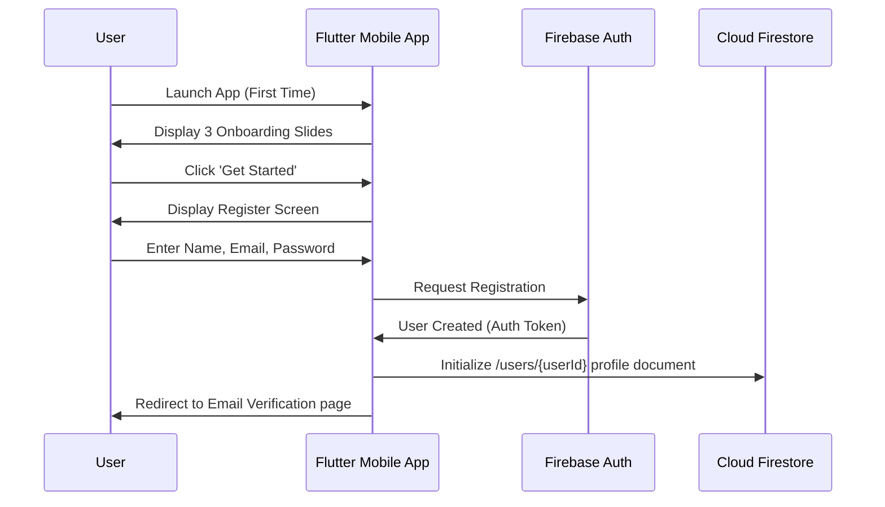
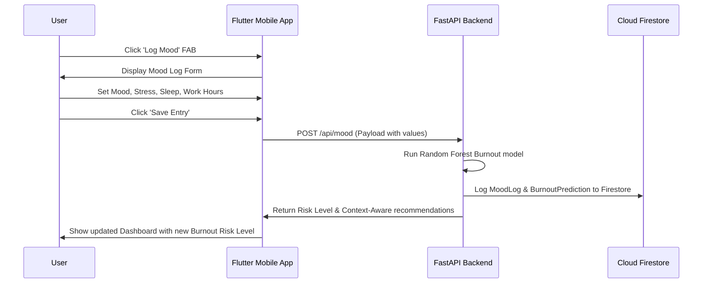

# MindSync AI – Product Design & UI/UX Specification Document
**AI-Driven Mental Wellness Companion for IT Professionals**  
**Role:** Lead UI/UX Designer & Product Architect  

---

## 1. Product Vision & Strategy

MindSync AI is built to help IT professionals manage stress, prevent burnout, and build healthy work-life habits. The design focus is on simplicity, clarity, and ease of use.

### A. Core UX Goals
*   **Low Friction Logs:** Allow users to log mood, sleep, water, and exercise in under 15 seconds.
*   **Actionable Insights:** Explain wellness trends and burnout risks clearly, without complex jargon.
*   **Empathetic Tone:** Keep copy warm and supportive, especially when displaying high burnout risks.
*   **Consistent Experience:** Ensure smooth navigation and readable layouts in both light and dark modes.

---

## 2. Design System (Tokens & Components)

### A. Color System
The colors are selected to create a clean, calm, and readable interface.

| Token Name | Light Mode HEX | Dark Mode HEX | Semantic Role |
| :--- | :--- | :--- | :--- |
| **Primary** | `#1E88E5` | `#64B5F6` | Main brand color, active buttons, selection indicators |
| **Secondary** | `#00ACC1` | `#4DD0E1` | Secondary actions, progress bars, wellness metrics |
| **Background** | `#F5F7FA` | `#121214` | Main screen background |
| **Surface** | `#FFFFFF` | `#1E1E24` | Card containers, dialog boxes, inputs |
| **Error** | `#D84315` | `#FF7043` | Alerts, high burnout warnings, error feedback |
| **Success** | `#43A047` | `#81C784` | Completed goals, positive stats, low risk indicators |
| **Warning** | `#F57C00` | `#FFB74D` | Medium risk indicators, pending alerts |
| **Info** | `#0288D1` | `#29B6F6` | Helpful tips, informational banners |

### B. Typography (Inter Typeface)
*   **Headline Large:** `32sp`, Bold, Line height `40px` (Splash & Onboarding Titles).
*   **Headline Medium:** `24sp`, Semi-Bold, Line height `32px` (Primary Page Headers).
*   **Title Large:** `18sp`, Semi-Bold, Line height `24px` (Card Titles).
*   **Body Large:** `16sp`, Regular, Line height `24px` (Main text copy, Chat dialogue).
*   **Body Medium:** `14sp`, Regular, Line height `20px` (Secondary text, helper copy).
*   **Label Small:** `12sp`, Medium, Line height `16px` (Captions, timestamps, small tags).

### C. Spacing & Grid System
We use a **4px-base grid system** for consistent padding and margins:
*   **Layout Margin:** `16dp` padding on the outer edges of screens.
*   **Card Padding:** `16dp` inner padding for content containers.
*   **SizedBox Spacing:** `4dp` (tiny), `8dp` (small), `16dp` (medium), `24dp` (large), `32dp` (extra-large).
*   **Corner Radius:** `12dp` for input fields; `16dp` for cards and dialogs; `24dp` for bottom sheets.

---

## 3. Application Navigation Map

```
[Splash Screen] ──(First Launch)──> [Onboarding (3 Slides)]
       │
  (Session Check)
       ├──> [Unauthenticated] ──> [Login] <──> [Register] ──> [Forgot Password]
       │
       └──> [Authenticated] ──> [Dashboard (Main Host)]
                                      ├── Tab 1: Dashboard Home
                                      ├── Tab 2: Mood Calendar & Logger
                                      ├── Tab 3: Gemini Chat Assistant
                                      ├── Tab 4: Reports & Charts
                                      └── Navigation Drawer / Headers:
                                               ├── [Profile Management]
                                               ├── [Smart Notifications Center]
                                               └── [Settings Controls]
```

---

## 4. User Flows

### A. New User Registration & Onboarding


### B. Daily Mood Logging & Burnout Check


---

## 5. Screen Specifications

### Splash Screen
*   **Purpose:** Initial loading, configuration check, and routing.
*   **UI Elements:** Center logo, clean branding tagline, loading indicator.
*   **Logic:**
    *   Init Firebase & load `.env` parameters.
    *   `IF` first launch $\rightarrow$ Route to Onboarding.
    *   `ELSE IF` User authenticated $\rightarrow$ Route to Dashboard.
    *   `ELSE` $\rightarrow$ Route to Login.

### Onboarding Carousel
*   **Purpose:** Introduce key features: Mood Tracking, Burnout Prediction, and Gemini AI Wellness Coaching.
*   **UI Elements:** 3 horizontal swipe slides, page indicators, "Skip" text, and a "Next"/"Get Started" button.

### Login Screen
*   **Purpose:** Authenticate returning users.
*   **UI Elements:** Logo, Email input, Password input (with show/hide toggle), "Forgot Password" link, "Login" button, and a link to register.
*   **Validation:** Email must match standard patterns; password is required.

### Dashboard (Main Screen)
*   **Purpose:** Primary wellness summary hub.
*   **UI Elements:** Welcome banner, Overall Wellness Score card, current Weather Widget, Burnout Risk card, Daily Activity cards, and a Quick Actions grid.

---

## 6. Dashboard Detailed Layout

```
+-------------------------------------------------------------+
|  [Avatar]  Good Morning, Jane!                [Bell] [Gear]  |
|  Tuesday, July 21                                           |
+-------------------------------------------------------------+
|  +-------------------------------------------------------+  |
|  |  WEATHER WIDGET                                       |  |
|  |  24°C - Mostly Clear (Sunny)                          |  |
|  |  Nudge: "It's nice outside. Take a 10-min walk."      |  |
|  +-------------------------------------------------------+  |
+-------------------------------------------------------------+
|  +---------------------------+ +--------------------------+  |
|  |  WELLNESS SCORE           | |  BURNOUT RISK            |  |
|  |  [  78 / 100  ]           | |  [  MEDIUM  ]            |  |
|  |  Good progress this week  | |  Risk score: 42%         |  |
|  +---------------------------+ +--------------------------+  |
+-------------------------------------------------------------+
|  DAILY TELEMETRY                                            |
|  +--------------+ +--------------+ +----------------------+  |
|  | [Icon] Steps | | [Icon] Water | | [Icon] Sleep         |  |
|  | 4,230 steps  | | 4 / 8 glass  | | 6.5 Hours            |  |
|  +--------------+ +--------------+ +----------------------+  |
+-------------------------------------------------------------+
|  QUICK ACTIONS                                              |
|  [ Log Mood ]    [ Ask AI Coach ]    [ View Charts ]        |
+-------------------------------------------------------------+
```

---

## 7. AI Chat Screen Specifications

*   **Interface Layout:**
    *   **Header:** Title "AI Wellness Coach" and sub-caption "Powered by Gemini". Includes a "Clear Chat" icon button.
    *   **Conversation List:** A scrollable list of messages. System responses render markdown layout constructs cleanly.
    *   **Footer:** Horizontal list of prompt suggestion chips (e.g. *"Tips for screen fatigue"*, *"Help me wind down"*), a text input field, and a "Send" button.
*   **Visual States:**
    *   **Loading:** Skeleton layout cells representing text boxes during history fetch.
    *   **Typing:** A clean three-dot pulsing animation while waiting for Gemini API responses.
    *   **Empty:** Renders a friendly coach icon and message: *"Hi! I'm your AI Coach. Feel free to ask wellness questions, or select a topic below to start."*

---

## 8. Mood Journal Screen Specifications

*   **Interface Layout:**
    *   **Mood Selector (Wheel/List):** Large horizontal icons mapping the moods: `Very Happy`, `Happy`, `Neutral`, `Sad`, `Anxious`, `Exhausted`, `Angry`. Selecting a mood dynamically updates the theme secondary accent.
    *   **Telemetry Sliders:**
        *   Stress Level Slider (Range: 1–10, with custom labels: *Calm* to *Severe*).
        *   Energy Level Slider (Range: 1–10, with custom labels: *Exhausted* to *Vibrant*).
    *   **Journal Input:** A multi-line text input field supporting up to 500 characters. Includes a live character counter and auto-save draft functionality.
    *   **Context Tags:** Multi-select chips for tags like `work`, `meeting`, `deadline`, `exercise`, `social`, `diet`.

---

## 9. Reports & Analytics Screen Specifications

*   **Interface Layout:**
    *   **Time Period Filters:** Filter tabs for `7 Days`, `30 Days`, and `90 Days`.
    *   **Charts Grid:**
        *   *Mood & Stress Trends:* Line chart mapping mood scores (green line) and stress levels (red line).
        *   *Sleep & Steps Analytics:* Bar chart showing daily tracked steps and hours of sleep.
    *   **AI Insight Summary Card:** Displays a Gemini-generated summary of the user's wellness metrics over the selected period.
    *   **Export Button:** A floating action button (FAB) to export report data as a PDF or CSV file.

---

## 10. Notifications Management

*   **Priority Categorization:**
    *   **High (Critical alerts):** High burnout risk warning. Renders as a system dialog overlay.
    *   **Medium (Daily goals):** Log prompts, hydration reminders, sleep nudges. Displays as regular push notifications.
*   **Unread Indicators:** Notification items in the list show a small green dot if unread. Swiping an item marks it as read or deletes it.

---

## 11. Profile & Settings Screen Specifications

*   **User Profile Layout:** Renders user details: full name, occupation tag, joined date, profile avatar, edit options, and stats summaries (e.g. *Mood logs count*, *Active days streak*).
*   **Settings Layout:**
    *   *Appearance:* Toggle switch for Dark Mode.
    *   *Preferences:* Push notification toggle switches for Hydration, Breaks, and Sleep.
    *   *Account Security:* Option to change password.
    *   *Data Management:*
        *   "Export Data" button: Downloads the user's entire log history as a JSON file.
        *   "Delete Account" button: Requires double confirmation and a password entry to securely delete all user data and auth credentials.

---

## 12. Accessibility (WCAG Compliance)

To ensure the app is usable by everyone, we adhere to standard accessibility guidelines:
*   **Touch Targets:** All buttons, chips, and links have a minimum hit area of **48dp x 48dp**.
*   **Contrast Ratio:** Standard copy text maintains a minimum contrast ratio of **4.5:1** against backgrounds in both light and dark modes.
*   **Dynamic Font Scaling:** UI layouts use flexible spacing (e.g. Wrap and Flexible widgets) to handle larger system font sizes without breaking.
*   **Screen Reader Labels:** All icons and image elements include descriptive `semanticsLabel` parameters.

---

## 13. Screen Wireframes (ASCII Specifications)

### Onboarding Carousel Wireframe
```
+---------------------------------------------------+
| Skip                                              |
|                                                   |
|                [ Lottie Animation ]               |
|                                                   |
|                Monitor Wellness                   |
|       Log mood, sleep, water, and exercise        |
|          with clean, easy-to-use logging.         |
|                                                   |
|                     o  *  o                       |
|                                                   |
|  +---------------------------------------------+  |
|  |                    Next                     |  |
|  +---------------------------------------------+  |
+---------------------------------------------------+
```

### AI Chat Screen Wireframe
```
+---------------------------------------------------+
|  [Back]         AI Wellness Coach         [Trash] |
+---------------------------------------------------+
|                                                   |
|  +---------------------------------------------+  |
|  | Hi! Ask me any wellness questions.          |  |
|  +---------------------------------------------+  |
|                                                   |
|  +---------------------------------------------+  |
|  | User: Tips for screen fatigue?              |  |
|  +---------------------------------------------+  |
|                                                   |
|  [Typing indicator: o o o]                        |
|                                                   |
|  [Tips for fatigue] [Breathing exercise]          |
|  +---------------------------------------------+  |
|  | Message...                              [>] |  |
|  +---------------------------------------------+  |
+---------------------------------------------------+
```

---

## 14. Animation Guidelines

*   **Transitions:** We use clean, standard Material Page Route transitions for navigating between screens (e.g., subtle slide and fade transitions).
*   **State Loaders:** Shimmer effects are used for loading cards, and a spinning logo is used for full-screen loading states.
*   **Micro-interactions:** Buttons expand slightly on hover/tap, and tags fade in smoothly when selected.

---

## 15. Flutter Widget Mapping

*   **App colors config:** `lib/core/theme/app_colors.dart`
*   **App theme config:** `lib/core/theme/app_theme.dart`
*   **Navigation router:** `lib/core/routing/app_router.dart`
*   **Custom action buttons:** `lib/shared/widgets/app_button.dart`
*   **Custom text fields:** `lib/shared/widgets/app_text_field.dart`
*   **Overlay state loading:** `lib/shared/widgets/loading_overlay.dart`
*   **Splash Screen:** `lib/features/authentication/presentation/pages/splash_page.dart`
*   **Onboarding Screen:** `lib/features/authentication/presentation/pages/onboarding_page.dart`
*   **Login Screen:** `lib/features/authentication/presentation/pages/login_page.dart`
*   **Register Screen:** `lib/features/authentication/presentation/pages/register_page.dart`
*   **Forgot Password Screen:** `lib/features/authentication/presentation/pages/forgot_password_page.dart`
*   **Dashboard Screen:** `lib/features/dashboard/presentation/pages/dashboard_page.dart`
*   **Mood Journal Screen:** `lib/features/mood/presentation/pages/mood_journal_page.dart`
*   **AI Chat Screen:** `lib/features/chat/presentation/pages/ai_chat_page.dart`
*   **Reports Screen:** `lib/features/reports/presentation/pages/reports_page.dart`
*   **Profile Screen:** `lib/features/profile/presentation/pages/profile_page.dart`
*   **Settings Screen:** `lib/features/settings/presentation/pages/settings_page.dart`

---

## 16. Summary

This design specification details the visual components and user flows for MindSync AI. We are ready to begin implementing Module 2 once you review and approve these specifications.
