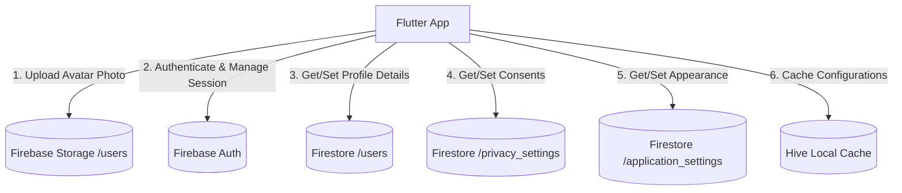

# MindSync AI – Module 10: Profile Management, Settings, Security & User Preferences

This document details the architecture, schemas, and security controls for user profile management, preferences, and privacy settings.

---

## 1. Module Architecture

The profile and settings module interacts directly with the Firebase SDK (Authentication, Firestore, and Storage) to query data and enforce user privacy.



---

## 2. Firestore Schemas

### A. Collection: `/users`
- `fullName`: String
- `email`: String
- `photoUrl`: String?
- `phoneNumber`: String?
- `dateOfBirth`: String?
- `gender`: String?
- `occupation`: String?
- `timezone`: String
- `country`: String
- `preferredLanguage`: String
- `bio`: String?
- `updatedAt`: Timestamp

### B. Collection: `/privacy_settings`
- Document ID: `userId`
- `analyticsCollection`: Boolean
- `aiPersonalization`: Boolean
- `locationAccess`: Boolean
- `notificationPermissions`: Boolean
- `dataSharing`: Boolean
- `updatedAt`: Timestamp

### C. Collection: `/application_settings`
- Document ID: `userId`
- `theme`: String ('light', 'dark', 'system')
- `fontSize`: String ('small', 'medium', 'large')
- `animationsEnabled`: Boolean
- `updatedAt`: Timestamp

---

## 3. Storage Guide (Firebase Storage)

- **Upload Path**: Profile photos are stored at `/users/{userId}/profile_photo.jpg`.
- **Security Rules**: Only the authenticated user matching `{userId}` can upload, edit, or delete the image. Read permissions are public to enable display in chat modules and leaderboards.
```javascript
rules_version = '2';
service firebase.storage {
  match /b/{bucket}/o {
    match /users/{userId}/{allPaths=**} {
      allow read: if request.auth != null;
      allow write, delete: if request.auth != null && request.auth.uid == userId;
    }
  }
}
```

---

## 4. Security & Account Deletion

### Re-authentication
Sensitive operations (updating emails, password shifts, and account deletion) require the user to re-authenticate by inputting their credentials using `reauthenticateWithCredential`.

### Full Data Wipe
When a user deletes their account:
1. The repository initiates a `WriteBatch` deletion sequence.
2. It deletes documents in `users`, `user_preferences`, `privacy_settings`, and `application_settings` corresponding to the `userId`.
3. It queries all documents matching `userId` in `mood_logs`, `recommendations`, `reports`, `notifications`, and `burnout_predictions`, adding them to the batch deletion.
4. The profile photo is deleted from Storage.
5. The FirebaseAuth user account is deleted, forcing an automatic logout.

---

## 5. Data Management & Exports

Users can export a complete backup from **Data Management**:
- **JSON**: Formats preferences and profile states into a JSON backup file.
- **CSV**: Compiles tracked telemetry metrics into table columns.
- **PDF**: Calls backend summary compilers to build a document report.
