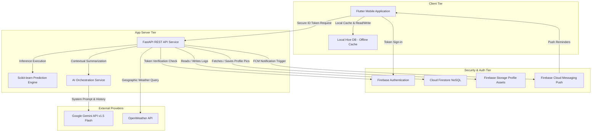
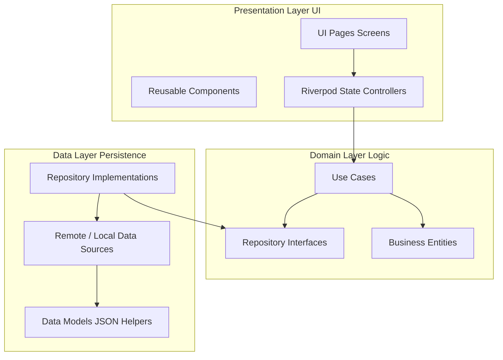
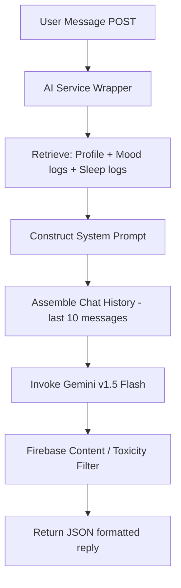
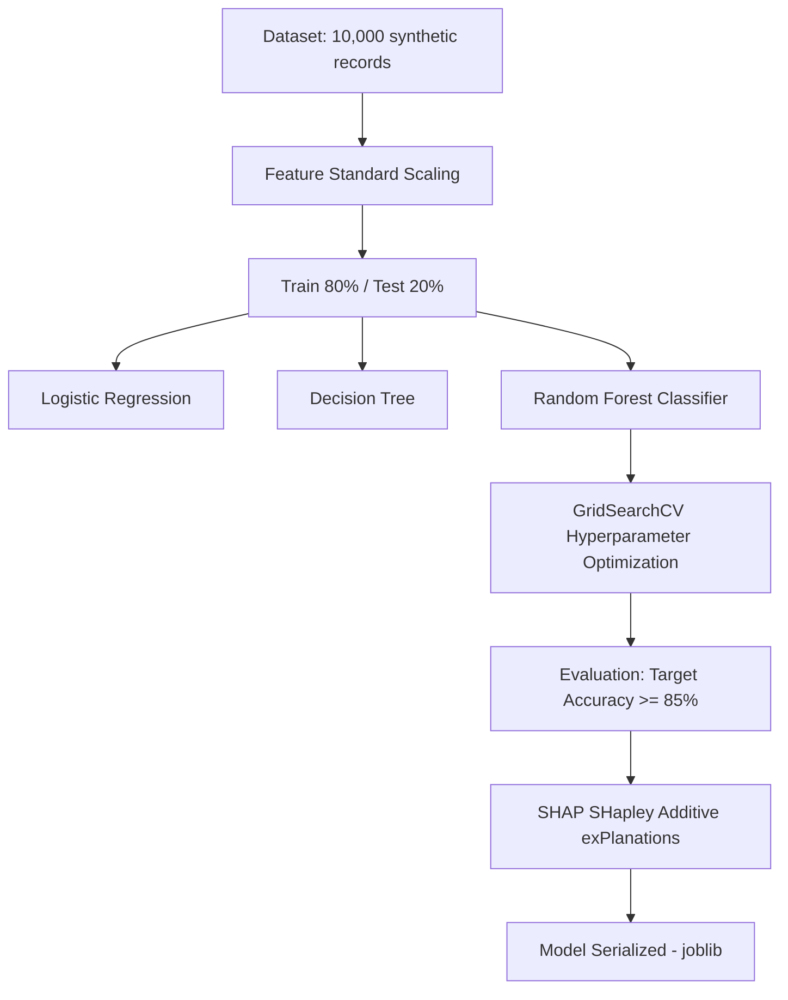
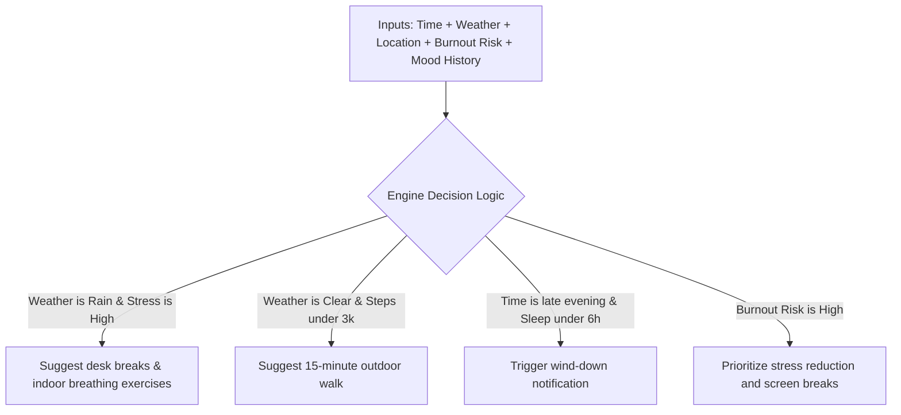
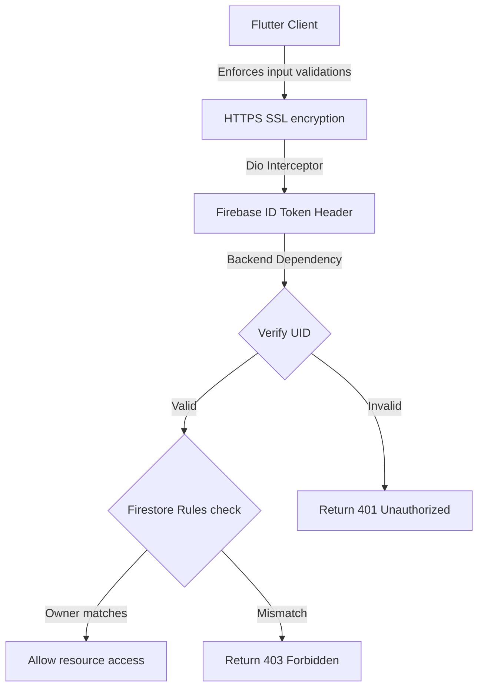

# MindSync AI – Software Architecture & System Design Document
**AI-Driven Mental Wellness Companion for IT Professionals**  
**Module:** CMP7003 – Emerging Mobile Applications  
**Role:** Senior Software Architect  

---

## 1. Overall Architecture

The MindSync AI ecosystem is designed as a distributed, highly available, secure, and offline-first mobile-cloud system. It consists of a cross-platform **Flutter Mobile Client**, a Python **FastAPI REST Service**, **Firebase Cloud Services**, and external APIs (**OpenWeather API**, **Gemini API**).



### Communication & Data Flows

#### A. Authentication Flow
1. The user logs in via Email/Password in the Flutter App.
2. Firebase Authentication registers the session, generating a short-lived JSON Web Token (ID Token).
3. The Flutter app stores this ID Token locally in a Hive encrypted box.
4. For every backend query, a custom Dio interceptor inserts the header `Authorization: Bearer <ID_Token>`.
5. FastAPI verifies the token structure and signatures against Google's public JWKS certificates, retrieving the verified user ID (`uid`).

#### B. Machine Learning Inference Flow
1. Flutter aggregates the user's latest 7-day health metrics (Sleep, stress, working hours, daily steps, water intake, active minutes) and fires a `POST` request to FastAPI `/api/predict/burnout`.
2. The FastAPI request schema validates parameters bounds via Pydantic.
3. The server runs the Random Forest model loaded in memory, computing a numeric prediction score, risk category (`Low`, `Medium`, `High`), and class confidence.
4. The service maps features against SHAP value matrices to isolate the top three contributing factors.
5. The result is logged into the Firestore `burnout_predictions` collection and returned to the client.

#### C. AI Conversational Flow
1. The user types a query in the chat console.
2. Flutter sends the message, along with the active session identifier, to FastAPI `/api/chat/message`.
3. FastAPI retrieves the user's profile metadata, historical mood logs, step logs, sleep metrics, and recent conversational memory.
4. The backend constructs a structured prompt combining context variables with target guidelines and submits it to the Gemini API (`gemini-1.5-flash`).
5. Gemini generates a tailored wellness suggestion, which FastAPI parses, logs, and forwards back to the user interface.

---

## 2. Flutter Clean Architecture

The mobile application implements a feature-based Clean Architecture structure to isolate the UI, business logic, and database layers.



### Layer Responsibilities
*   **Presentation Layer (UI & Controllers):** Focuses solely on rendering and user interaction. Flutter widgets react to changes in state exposed by Riverpod Providers. Providers call the Domain Use Cases and handle loading/error transitions.
*   **Domain Layer (Core Logic):** The independent core. It contains clean Dart models (`Entities`), specialized functional instructions (`UseCases`), and abstract repository boundaries (`Repository Interfaces`). It has zero dependencies on external frameworks or databases.
*   **Data Layer (Infrastructure):** Implements repository contracts. It maps network payloads to models (`Models`), decides between offline Hive structures (`Local Data Sources`) and cloud API endpoints (`Remote Data Sources`), and performs operations like data synchronization.
*   **Core Layer:** Houses shared configurations: theme configurations, routing trees, static constants, validation utilities, and custom failure types.
*   **Dependency Injection (DI):** Managed declaratively using Riverpod. Providers initialize data sources, network client wrappers, repositories, and individual use cases, maintaining singletons where required.

---

## 3. Backend Architecture (FastAPI)

The FastAPI backend uses a decoupled, layered approach.

```
backend/
├── app/
│   ├── api/
│   │   ├── routers/          # Routes categorizing endpoints (Auth, Mood, AI)
│   │   └── dependencies/     # Request extractors, auth, rate-limiters
│   ├── core/
│   │   ├── config.py         # Base settings (Pydantic Settings wrapper)
│   │   ├── security.py       # Firebase verification, token validation
│   │   └── exceptions.py     # Global exception handlers and overrides
│   ├── firebase/
│   │   ├── admin_sdk.py      # App credentials initializer
│   │   └── firestore_repo.py # Generic collection CRUD wrappers
│   ├── ml/
│   │   ├── train.py          # Data preparation and ML model execution
│   │   └── models/           # Output serialized files (Joblib classifier)
│   ├── models/               # Domain-level backend dataclasses
│   ├── schemas/              # Pydantic schemas validating input payloads
│   ├── services/
│   │   ├── ai_service.py     # System prompts configuration, Gemini API integration
│   │   ├── ml_service.py     # Prepares parameters, outputs predictions
│   │   └── weather_service.py# HTTP client requesting OpenWeather metadata
│   └── main.py               # API register, middlewares configuration, log configurations
```

---

## 4. Project Folder Structures

Detailed layout of directories in production:

### A. Flutter Directory Tree
```
frontend/
├── assets/
│   ├── animations/           # Lottie JSON configurations
│   ├── icons/                # Material vectors and system SVGs
│   ├── images/               # App branding files
│   └── .env                  # Decoded environment variables
├── lib/
│   ├── core/
│   │   ├── constants/        # API endpoints, box names, static strings
│   │   ├── errors/           # Failures and Exception types
│   │   ├── network/          # Dio configurations and interceptors
│   │   ├── routing/          # GoRouter pages register
│   │   ├── services/         # Storage (Hive) initialization service
│   │   └── theme/            # Theme setups and typography config
│   ├── features/
│   │   ├── authentication/
│   │   ├── dashboard/
│   │   ├── mood/
│   │   ├── chat/
│   │   ├── reports/
│   │   ├── recommendations/
│   │   ├── notifications/
│   │   ├── profile/
│   │   └── settings/
│   │       ├── domain/
│   │       │   ├── entities/
│   │       │   ├── usecases/
│   │       │   └── repositories/
│   │       ├── data/
│   │       │   ├── datasources/
│   │       │   ├── models/
│   │       │   └── repositories/
│   │       └── presentation/
│   │           ├── pages/
│   │           ├── providers/
│   │           └── widgets/
│   ├── shared/
│   │   ├── models/           # Shared models
│   │   └── widgets/          # Shared components (buttons, loaders, fields)
│   └── main.dart
└── test/
    ├── unit/                 # Mock and business tests
    ├── widget/               # Screen design and rendering tests
    └── integration/          # Core navigation flow tests
```

### B. FastAPI Directory Tree
```
backend/
├── app/
│   ├── api/
│   │   ├── routers/
│   │   │   ├── auth_router.py
│   │   │   ├── mood_router.py
│   │   │   ├── prediction_router.py
│   │   │   └── chat_router.py
│   │   └── dependencies/
│   │       ├── auth_bearer.py
│   │       └── rate_limiter.py
│   ├── core/
│   │   ├── config.py
│   │   ├── security.py
│   │   └── exceptions.py
│   ├── models/
│   ├── schemas/
│   │   ├── mood_schema.py
│   │   ├── prediction_schema.py
│   │   └── chat_schema.py
│   ├── services/
│   └── main.py
├── ml/
│   ├── dataset/
│   │   └── raw_burnout_dataset.csv
│   ├── models/
│   │   └── burnout_model.pkl
│   ├── train.py
│   └── evaluate.py
├── tests/
│   ├── conftest.py
│   ├── test_endpoints.py
│   └── test_ml_pipeline.py
├── Dockerfile
├── requirements.txt
└── .env
```

---

## 5. Database Design (Firestore)

### Collection: `users`
*   **Path:** `/users/{userId}`
*   **Indexing:** Automatic indexing on `uid`, `email`.
*   **Firestore Rules:**
    ```javascript
    match /users/{userId} {
      allow read, write: if request.auth != null && request.auth.uid == userId;
    }
    ```

### Collection: `mood_logs`
*   **Path:** `/mood_logs/{logId}`
*   **Indexing:** Compound index on `userId` (Ascending) + `createdAt` (Descending).
*   **Firestore Rules:**
    ```javascript
    match /mood_logs/{logId} {
      allow read, write: if request.auth != null && resource.data.userId == request.auth.uid;
      allow create: if request.auth != null && request.resource.data.userId == request.auth.uid;
    }
    ```

### Collection: `activity_logs`
*   **Path:** `/activity_logs/{logId}`
*   **Indexing:** Compound index on `userId` + `date`.
*   **Firestore Rules:** Enforce user boundaries via authentication matches.

### Collection: `chat_sessions`
*   **Path:** `/chat_sessions/{sessionId}`
*   **Sub-collection:** `messages` $\rightarrow$ `/chat_sessions/{sessionId}/messages/{messageId}`
*   **Firestore Rules:** Read/Write restrictions apply to verified session owners.

### Collection: `burnout_predictions`
*   **Path:** `/burnout_predictions/{predictionId}`
*   **Firestore Rules:** Read permission only for the corresponding `userId`.

### Collection: `recommendations`
*   **Path:** `/recommendations/{recommendationId}`
*   **Indexing:** Index on `userId` + `completed` + `priority`.

---

## 6. Data Models

### A. User Profile Model
*   **Validation Rules:** `age` must be an integer between 18 and 100; `fullName` must have length between 2 and 50 characters; `email` must match standardized regex formats.
*   **Sample JSON:**
    ```json
    {
      "uid": "usr_9988ff",
      "fullName": "Alice Smith",
      "email": "alice.smith@dev.com",
      "occupation": "Software Engineer",
      "age": 29,
      "gender": "Female",
      "createdAt": "2026-07-21T09:46:49Z",
      "onboardingCompleted": true
    }
    ```

### B. Mood Log Model
*   **Validation Rules:** `moodScore`, `stressLevel`, `energyLevel` must fall strictly between 1 and 10.
*   **Sample JSON:**
    ```json
    {
      "id": "log_a8f93",
      "userId": "usr_9988ff",
      "mood": "Anxious",
      "moodScore": 4,
      "stressLevel": 7,
      "energyLevel": 3,
      "journal": "Upcoming production release is causing anxiety.",
      "tags": ["work", "deadline"],
      "createdAt": "2026-07-21T15:18:12Z"
    }
    ```

### C. Burnout Prediction Model
*   **Sample JSON:**
    ```json
    {
      "id": "pred_29a1b",
      "userId": "usr_9988ff",
      "burnoutRisk": "Medium",
      "confidence": 0.79,
      "riskScore": 62.5,
      "importantFactors": ["Prolonged working hours (9.5h)", "High stress levels"],
      "createdAt": "2026-07-21T15:20:00Z"
    }
    ```

---

## 7. API Design

### A. Authentication Verification
*   **URL:** `POST /api/auth/verify`
*   **Request:** Empty payload (requires `Authorization: Bearer <token>` header).
*   **Response (200 OK):**
    ```json
    {
      "success": true,
      "message": "Token verified successfully",
      "data": { "uid": "usr_9988ff", "email": "alice@dev.com" }
    }
    ```
*   **Errors:** `401 Unauthorized` for missing/expired credentials.

### B. Mood Log Entry Creation
*   **URL:** `POST /api/mood`
*   **Request Body:**
    ```json
    {
      "mood": "Happy",
      "moodScore": 8,
      "stressLevel": 2,
      "energyLevel": 7,
      "journal": "Successfully refactored modular router structures.",
      "tags": ["productivity"]
    }
    ```
*   **Response (201 Created):** Includes a success message and database confirmation.
*   **Validation:** Throws `400 Bad Request` if stress/energy parameters are outside the 1–10 range.

### C. Get Latest Predictions
*   **URL:** `GET /api/prediction/latest`
*   **Response (200 OK):** Outputs latest risk predictions or returns `404 Not Found` if no logs exist.

### D. Submit AI Message
*   **URL:** `POST /api/chat/message`
*   **Request Body:** `{ "sessionId": "session_001", "message": "I feel very tired today." }`
*   **Response (200 OK):** Returns the chatbot reply payload and updates memory indices.

---

## 8. AI Architecture

MindSync AI's conversational coaching is designed around the **Gemini v1.5 Flash** model, selected for low latency and high quality on textual summaries.



### A. Prompt Engineering Strategy
A dynamic prompt is constructed at the server for every interaction.
*   **System Guidelines:** *"You are MindSync AI, an empathetic wellness coach for IT professionals. You suggest healthy boundaries, stress reduction habits, and digital breaks. You do not offer clinical diagnosis. Maintain answers under 150 words. Adopt a warm, professional tone."*
*   **Context Ingestion:** The prompt includes active profile variables: *"The user is a Software Engineer, aged 29. Their average stress level over the last 3 days was 8/10. Sleep averaged 5.5 hours."*

### B. Conversation Memory
FastAPI retains the last 10 message documents under the active sub-collection to prevent token bloat, ensuring context-aware responses without excessive API charges.

### C. Safety Filters & Key Security
*   **Content Restrictions:** The API configuration overrides safety configurations to flag and reject queries relating to self-harm, hate speech, or explicit clinical queries.
*   **Key Storage:** API credentials are loaded dynamically via Docker/Render configuration contexts, preventing keys from leaking to version control.

---

## 9. Machine Learning Architecture

The burnout classification module implements a supervised model to identify risk factors early.



### A. Data Preparation & Features
*   **Input Tabular Matrix:** `sleep_hours`, `working_hours`, `mood_score`, `stress_level`, `energy_level`, `water_intake`, `daily_steps`, `exercise_minutes`.
*   **Engineering:** StandardScaler handles steps variance. Missing fields default to localized averages.

### B. Model Execution Flow
1.  **Training:** The Random Forest Classifier executes using cross-validation (`cv=5`).
2.  **SHAP Feature Isolations:** Computes the mathematical impact of individual features. The backend formats feature scores into clear user insights (e.g. *"Low sleep is contributing most to your risk score"*).
3.  **Accuracy Standard:** The model target accuracy matches or exceeds **85%**.

---

## 10. Context Awareness

MindSync AI uses context-aware inputs to deliver personalized recommendations.



### Decision Logic Examples:
*   `IF` Weather = *Rainy* `AND` StressLevel $\ge 7$ $\rightarrow$ Generate indoor recommendations (e.g. 5-minute desktop stretches, progressive muscle relaxation).
*   `IF` Weather = *Clear* `AND` CurrentSteps $\le 3000$ `AND` Time = *14:00* $\rightarrow$ Suggest a brief outdoor walk.
*   `IF` BurnoutRisk = *High* $\rightarrow$ Re-rank recommendations to place stress-reduction and recovery suggestions at the top, bypassing intense activity targets.

---

## 11. Notification System

Smart notification scheduling uses local notifications to nudge behavior patterns without triggering notification fatigue.

| Notification Category | Trigger Condition | Delivery Window | UI Nudge Message |
| :--- | :--- | :--- | :--- |
| **Hydration Alert** | Dynamic (every 3 hours) | 09:00 - 21:00 | "Time to stretch and log a glass of water to keep your focus sharp!" |
| **Log Mood Nudge** | Log absent by evening | 18:30 | "How was your day? Log your mood to track your stress trends." |
| **Burnout Risk Warning** | Prediction updates to High | Immediately | "You've been working long hours. Let's take a screen-free break." |
| **Walk Incentive** | Steps $\le 3000$ by mid-afternoon | 15:00 | "Step count is low. It's sunny outside; perfect for a brief walk." |
| **Sleep Prompt** | Historic sleep $\le 6$ hours | 22:00 | "Ready for bed? Target an early rest tonight to recharge." |

---

## 12. Security Design



### Key Security Policies
1.  **Authentication Enforcement:** The backend enforces token-based route protection on all transaction routes using standard Firebase signature decoders.
2.  **Firestore Permissions:** Database configuration rules explicitly prevent cross-user document access.
3.  **Secure Storage:** JWT tokens and offline credentials are encrypted in local device storage using Hive encryptions.
4.  **Secrets Isolation:** API keys are never stored in code; they are loaded at runtime from environment configurations.

---

## 13. Error Handling Strategy

MindSync AI implements a structured, multi-layer error handling system:

*   **Network Faults:** The Dio client implements custom interceptors to catch connection timeouts and network drops. It maps these to a standard `NetworkFailure` model and updates the UI with an offline state banner, allowing the user to continue logging data locally.
*   **Database Synchronization Failures:** If the app fails to write data to Firestore due to network loss, it logs the transaction to a local Hive box sync queue. A background connection listener monitors the network and pushes the pending logs once online status is restored.
*   **Validation Errors (400 Bad Request):** Input parameters are validated on the client first. If invalid data reaches the backend, Pydantic catches it and returns a standard error schema (`{ "success": false, "message": "Validation failed: [reasons]" }`).
*   **Server Outages (500 Internal Server Error):** Uncaught exceptions are handled by a global FastAPI middleware. It logs the trace context securely using Loguru (masking PII) and returns a clean, non-revealing error message to the client.

---

## 14. Performance Strategy

*   **Repository-Driven Cache-Aside Caching:** Mobile repositories check local Hive boxes first. This ensures immediate rendering of page states, while network updates execute asynchronously.
*   **Database Query Optimization:** Document designs are kept small and structured. Compound indexes are configured for queries utilizing multiple fields (e.g. `userId` + `createdAt`) to prevent slow database operations.
*   **Background Telemetry Tuning:** Motion sensors (Accelerometer, step counters) use low-power, system-level listener APIs. Pedometer checks are deferred to battery-efficient intervals rather than polling continuously.
*   **API Response Serialization:** Pydantic validation uses serialization engines to minimize API processing delays.

---

## 15. Development Roadmap

### Module 1 – Core Project Scaffold
*   **Objective:** Establish workspace configurations.
*   **Deliverables:** Light/Dark themes, GoRouter paths, Hive setup, Dio client.
*   **Dependencies:** None.
*   **Order:** 1 (Completed).

### Module 2 – Authentication & Onboarding
*   **Objective:** Secure login, registration, and onboarding flows.
*   **Deliverables:** Firebase Authentication integration, login page, registration page, onboarding carousel, and Firestore user document creation.
*   **Dependencies:** Module 1.
*   **Order:** 2.

### Module 3 – Dashboard UI & Telemetry
*   **Objective:** Home experience page layout.
*   **Deliverables:** Primary dashboard grid, wellness score card, activity display, weather widget (API wrapper).
*   **Dependencies:** Module 2.
*   **Order:** 3.

### Module 4 – Mood Journaling & History
*   **Objective:** User log tracking forms and lists.
*   **Deliverables:** Mood wheel UI, stress slider, entry database updates, and historical calendar view.
*   **Dependencies:** Module 3.
*   **Order:** 4.

### Module 5 – Gemini Conversational Coach
*   **Objective:** Empathetic wellness chatbot interface.
*   **Deliverables:** Chat console page, system context prompts, session histories.
*   **Dependencies:** Module 4.
*   **Order:** 5.

### Module 6 – Machine Learning Burnout Predictor
*   **Objective:** Tabular burnout classifier.
*   **Deliverables:** Training script, best model (Pickle), evaluation matrix, feature importance extraction.
*   **Dependencies:** Module 4.
*   **Order:** 6.

### Module 7 – FastAPI REST API Service
*   **Objective:** Backend computing logic.
*   **Deliverables:** API route logic, ML prediction wrapper, Gemini API connection logic.
*   **Dependencies:** Module 5, Module 6.
*   **Order:** 7.

### Module 8 – Reports & Visual Charts
*   **Objective:** Performance summaries page.
*   **Deliverables:** Weekly trend graphs (fl_chart), AI reports summary, PDF exporter.
*   **Dependencies:** Module 4, Module 7.
*   **Order:** 8.

### Module 9 – Notifications Engine
*   **Objective:** Habit reminder notifications.
*   **Deliverables:** Push notifications and local reminder schedules.
*   **Dependencies:** Module 3, Module 8.
*   **Order:** 9.

### Module 10 – User Profile & Settings
*   **Objective:** App preferences control page.
*   **Deliverables:** Preference toggle options, theme configurations, data deletion logic.
*   **Dependencies:** Module 2.
*   **Order:** 10.

---

## 16. Technical Risks & Mitigation

1.  **Firebase Connection Outages:** Local Hive caches allow the user to read and log data offline, which is queued for synchronization once connectivity is restored.
2.  **API Rate Limiting (Gemini/OpenWeather):** If external APIs limit requests, the server uses cached forecast records and defaults to rule-based fallback responses.
3.  **Sensors Incompatibilities:** Pedometer sensor bindings degrade gracefully to manual log interfaces if the host device lacks hardware tracking.
4.  **Toxicity or Inappropriate AI Outputs:** System instructions are configured with high safety thresholds, and the application displays a clear wellness coaching disclaimer.

---

## 17. Summary & Deliverables

This system architecture document specifies the technical design for MindSync AI, serving as a blueprint for the implementation. Development will proceed module-by-module in the recommended order.
